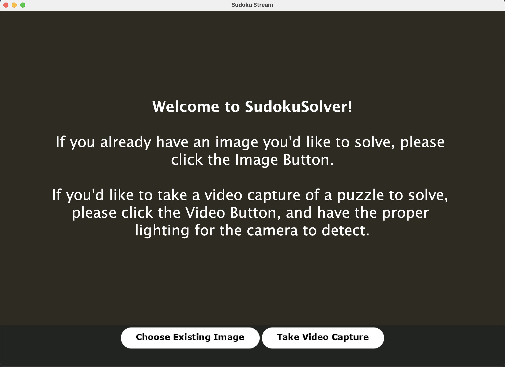
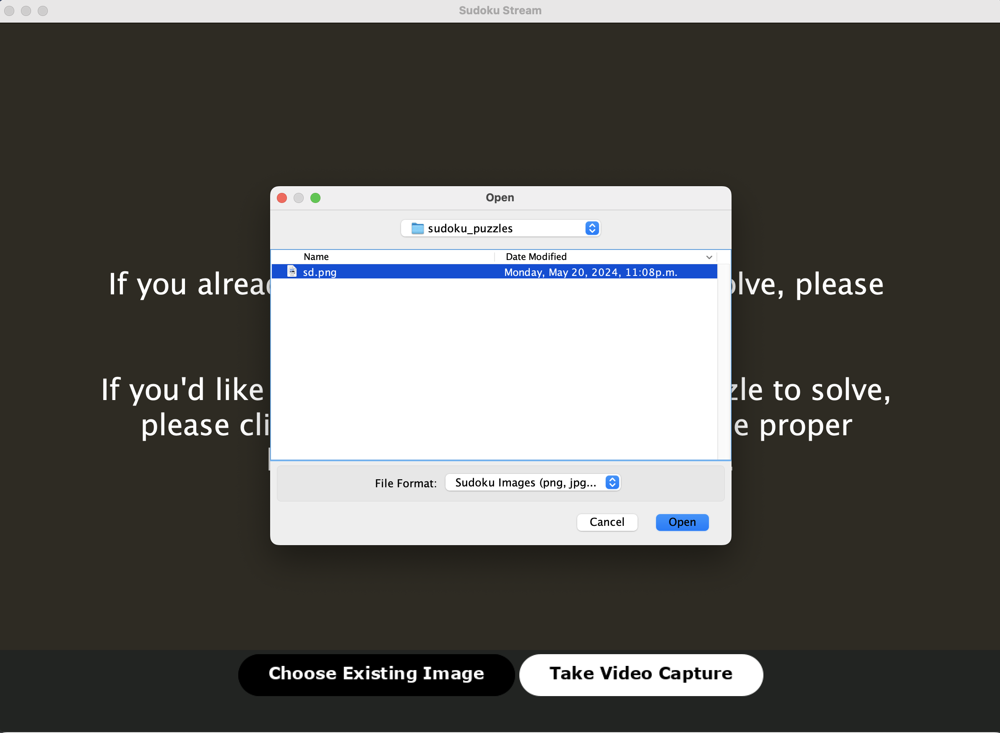
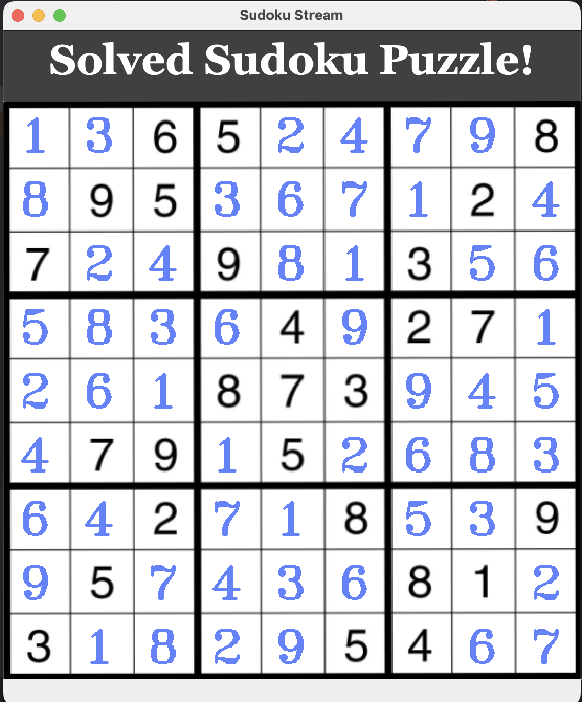
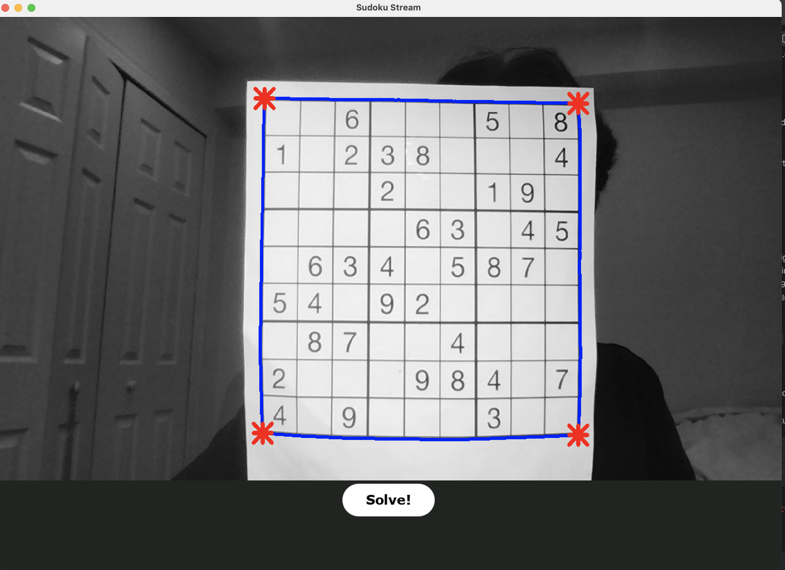
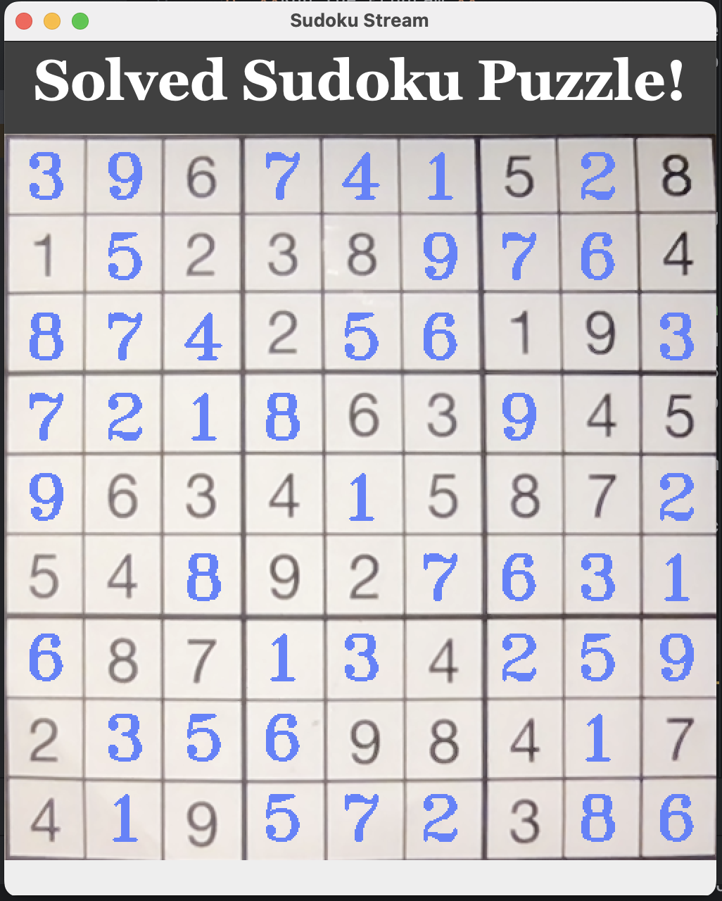
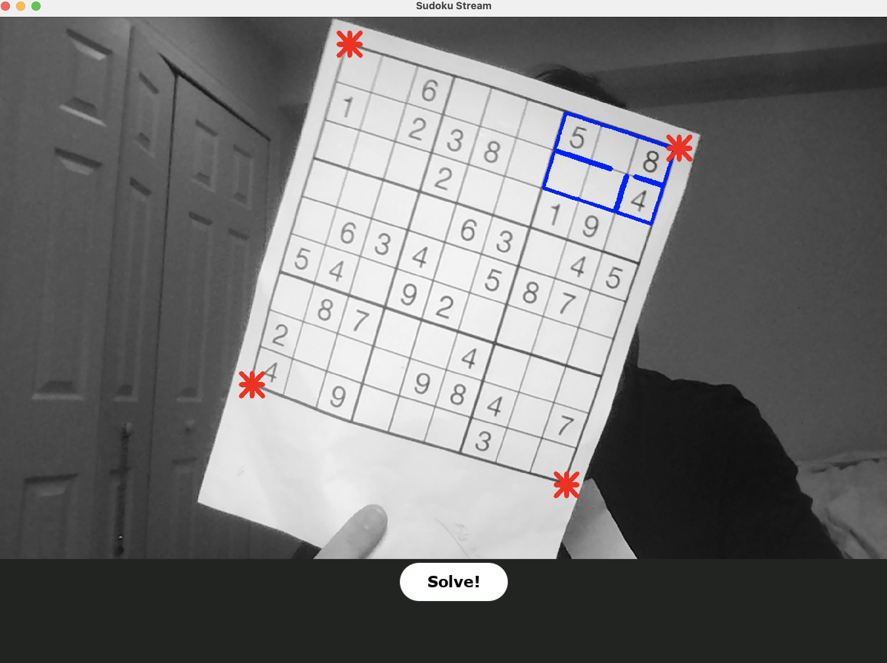
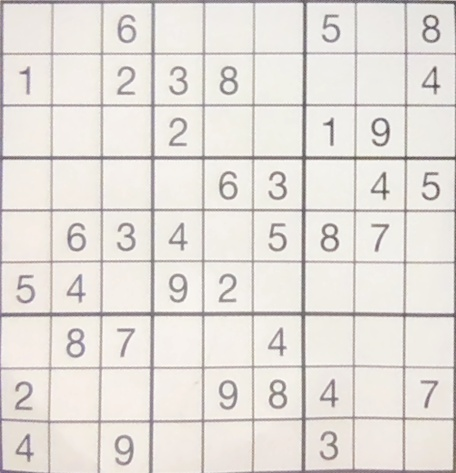
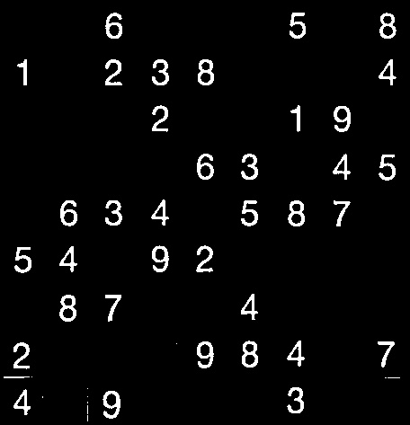
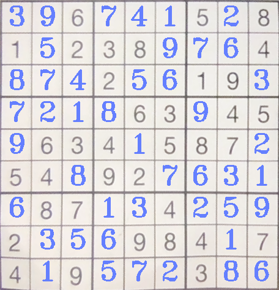

# SudokuCV Solver

## Installation

1. **Clone the Repository:**
   ```bash
   git clone https://github.com/andrewpols/SudokuCV.git
   ```
   Or download the .zip file of the project.


2. **Set Up OpenCV and Tesseract Libraries:**
    - All files associated with the TESSERACT library/dependencies should be included within the project structure.
      - If for some reason they are not, please refer to the following resources to download the requirements:
    - Download and install OpenCV for Java from [here](https://opencv.org/releases/).
    - To use Tesseract OCR, download and install Tesseract and its Java wrapper (Tess4J) from [here](https://github.com/nguyenq/tess4j).
      - IF USING MACOS:
        - OpenCV is not directly supported for Mac. To download it, you must use some variation of a python environment
          to properly download OpenCV. 
        - eg. Anaconda virtual environments OR using homebrew to download OpenCV
        - Provided is [a link](https://youtu.be/68IrlXObQyE?si=Y83KjDtdZ6bgENfZ) to a YouTube guide on how to do so.

3. **Import Libraries into Your IDE:**
    - Add the OpenCV and Tesseract libraries to your project's build path.

4. **Configure Library Path:**
    - If you're using a dynamic library (e.g., `.dylib` for MacOS), ensure that the library path is correctly set:
      ```bash
      java -Djava.library.path=/path/to/libraries -jar your_application.jar
      ```

5. **Build the Project:**
    - Open the project in your preferred Java IDE (e.g., IntelliJ IDEA, Eclipse).
    - Build the project to resolve dependencies and compile the source code.

6. **Run the Program:**
    - Ensure that the required libraries (OpenCV and Tesseract OCR) are properly configured and accessible in your project.
    - Run the main class (`SudokuCV.java`) to start the Sudoku Solver application.

## Usage

- **Project Goal:**
    - The goal of the game is to fill a 9x9 grid with digits so that each column, each row, and each of the nine 3x3 subgrids contain all of the digits from 1 to 9.
    - A digit cannot be repeated in the same row, column, or 3x3 square.
- **Playing the Game:**
  - After running the program in `SudokuCV.java`, simply follow the on-screen instructions.
  - The user has two options to provide a Sudoku Puzzle:
    - Choose an already existing image of a Sudoku grid on their device
    - Allow a Video Capture that reads a Sudoku grid in real time
- **Purpose:**
  - After creating a Sudoku Solving algorithm, I found it was far too time-consuming to manually
    input the data of the grid manually. 
  - Using computer vision automates this process, allowing quick, real-time solutions

## Tutorial: Image Examples

### - Choose Image Pathway




### - Live Video Pathway




## Backend Images




[Extracted Cells](./docs/data/cells)


